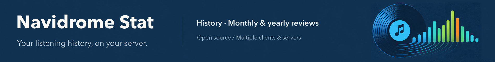
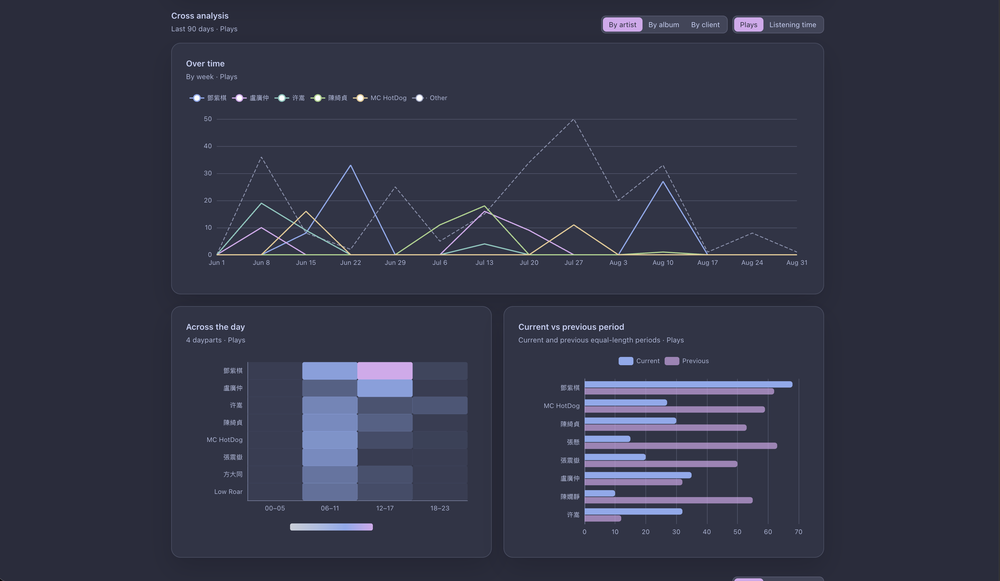
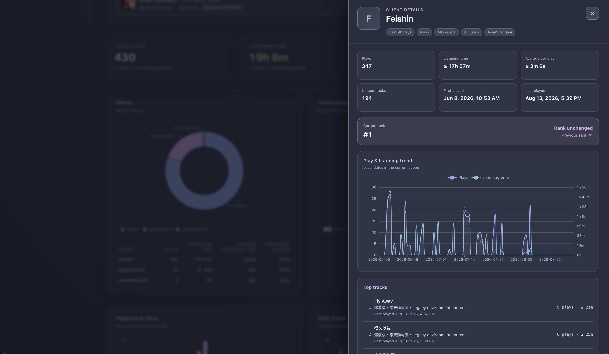
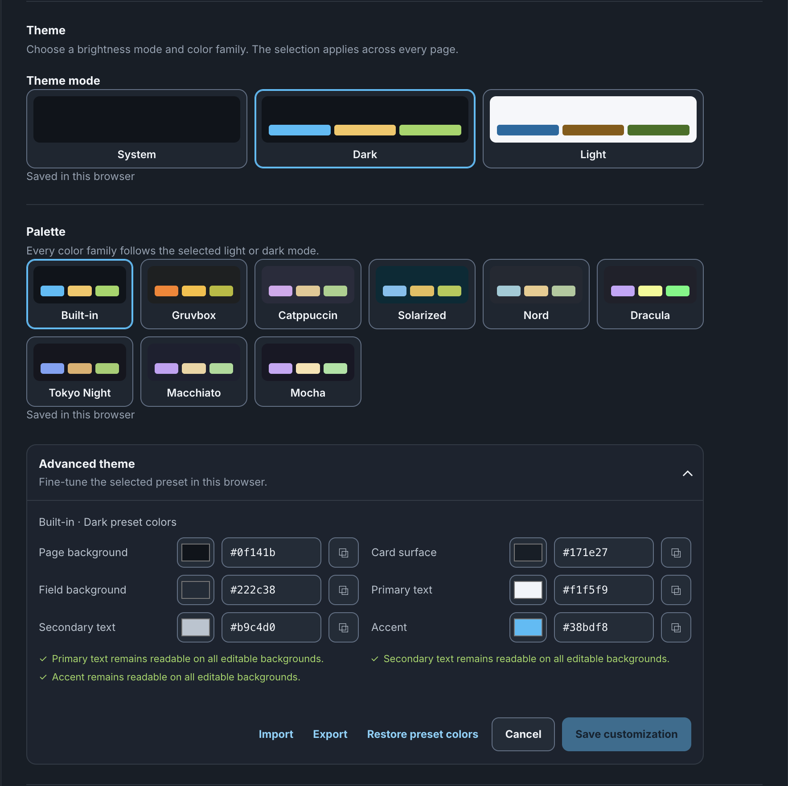

<div align="center">

<h1>
  <picture>
    <source media="(max-width: 600px)" srcset="assets/banner-en-compact.png">
    
  </picture>
</h1>

<p>
<picture>
  <source media="(prefers-color-scheme: dark)" srcset="assets/icon-dark.svg">
  
</picture>
&nbsp;
<a href="https://www.producthunt.com/products/navidrome-stat/launches/navidrome-stat?embed=true&amp;utm_source=badge-featured&amp;utm_medium=badge&amp;utm_campaign=badge-navidrome-stat" target="_blank" rel="noopener noreferrer"><picture><source media="(prefers-color-scheme: dark)" srcset="https://api.producthunt.com/widgets/embed-image/v1/featured.svg?post_id=1207528&amp;theme=dark&amp;t=1787616376509"></picture></a>
</p>

[](LICENSE)
[](https://hub.docker.com/r/stepaniah/navidrome-statistic)
[](https://hub.docker.com/r/stepaniah/navidrome-statistic)


</div>

[简体中文](README.zh-CN.md) · [Documentation](docs/README.md) · [Changelog](CHANGELOG.md)

**Self-hosted listening statistics for Navidrome.** See what you listen to across your clients and servers, with playback history, detailed charts, and monthly or yearly reviews.

Navidrome Stat collects activity reported to your Navidrome server and stores it in SQLite. Keep using your existing Subsonic-compatible players; open the dashboard when you want to explore your listening history.

## Features

- **One view across clients and servers** — now playing, listening time, history, client usage, and transcoding, filterable by date, server, and user.
- **Explore your listening habits** — artist, album, and track rankings; daily and hourly trends; heatmaps; detail views; and comparisons with the preceding period.
- **Monthly and yearly Listening Review** — listening streaks, top lists, time-of-day patterns, and tracks first recorded in that period.
- **Flexible artist credits** — show collaborating artists together or credit them separately while keeping overall play totals consistent.
- **Control access and data** — administrator and read-only viewer tokens, optional server/user restrictions, retention settings, and per-user JSON export, import, and deletion.
- **Make it yours** — seven languages, nine palette families with light and dark variants, custom colors, and layouts for desktop and mobile.
- **Run it on your own server** — Docker images for amd64 and arm64, locally served frontend assets, no usage telemetry, and optional ListenBrainz-compatible ingestion.

## Screenshots

| | |
| --- | --- |
|  |  |
|  |  |
|  | |

## Quick start

You need Docker Compose v2 and a Navidrome account accessible from the container. The example uses the current stable release, [v0.9.3](https://github.com/StepaniaH/navidrome-stat/releases/tag/v0.9.3).

Create a directory containing these two files. In `.env`, replace the example values and choose a long, random dashboard token:

```dotenv
NAVIDROME_URL=https://navidrome.example.invalid
NAVIDROME_USER=example_user
NAVIDROME_PASS=replace-with-your-navidrome-password
STATS_API_TOKEN=replace-with-a-long-random-token
```

Save the following as `compose.yaml`:

```yaml
services:
  navidrome-stat:
    image: stepaniah/navidrome-statistic:v0.9.3
    container_name: navidrome-stat
    ports:
      - "39421:39421"
    volumes:
      - navidrome-stat-data:/data
    environment:
      DATABASE_URL: /data/navidrome_stats.db
      NAVIDROME_URL: ${NAVIDROME_URL:?Set NAVIDROME_URL in .env}
      NAVIDROME_USER: ${NAVIDROME_USER:?Set NAVIDROME_USER in .env}
      NAVIDROME_PASS: ${NAVIDROME_PASS:?Set NAVIDROME_PASS in .env}
      STATS_API_TOKEN: ${STATS_API_TOKEN:?Set STATS_API_TOKEN in .env}
    restart: unless-stopped

volumes:
  navidrome-stat-data:
```

Start the service from that directory:

```bash
docker compose up -d
```

Open [localhost:39421](http://localhost:39421) and sign in with `STATS_API_TOKEN`. Add further servers in **Settings > Connections**. Once a saved connection exists, the app uses the saved connection list instead of the environment fallback.

Run one instance with one worker per set of sources. Recording depends on playback reported to Navidrome; installation does not recover a complete past history. For remote access, use an HTTPS reverse proxy. See the [deployment guide](docs/deployment.md) for the full setup and [collection guide](docs/collection.md) for counting rules.

## Documentation

| Guide | Contents |
| --- | --- |
| [Deployment](docs/deployment.md) | Docker setup, connections, storage, and runtime requirements |
| [Configuration](docs/configuration.md) | Environment variables, defaults, and viewer access |
| [Using the dashboard](docs/usage.md) | Filters, details, Listening Review, themes, and languages |
| [Collection and counting](docs/collection.md) | Play thresholds, duration quality, backfill, and ListenBrainz |
| [Operations](docs/operations.md) | Updates, backups, recovery, and troubleshooting |
| [Privacy](docs/privacy.md) · [Security](SECURITY.md) | Stored data, access controls, and vulnerability reporting |

See the [documentation index](docs/README.md) for artist attribution, chart behavior, and compatibility details. Release changes are in the [changelog](CHANGELOG.md).

## Contributing and support

Bug reports, translations, and pull requests are welcome. Read [Contributing](CONTRIBUTING.md) for the development setup and checks. Report bugs or suggest features in [GitHub Issues](https://github.com/StepaniaH/navidrome-stat/issues); report vulnerabilities through the [security policy](SECURITY.md).

## License

[MIT](LICENSE). Bundled Tailwind CSS and Apache ECharts retain their licenses and notices in `src/static/vendor/`.
