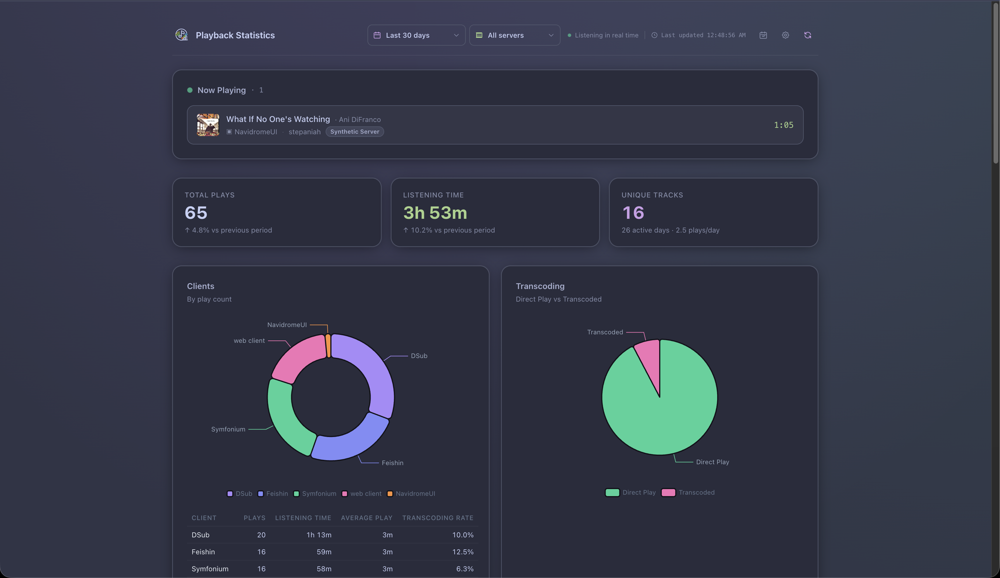
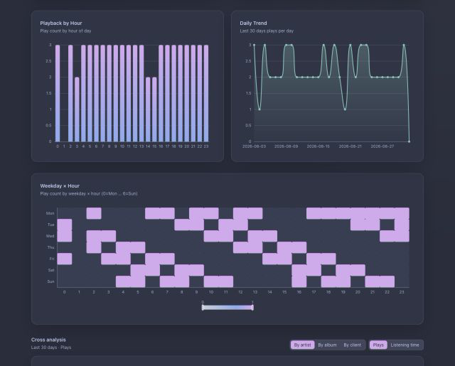
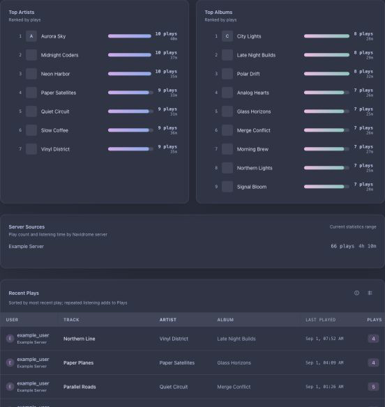
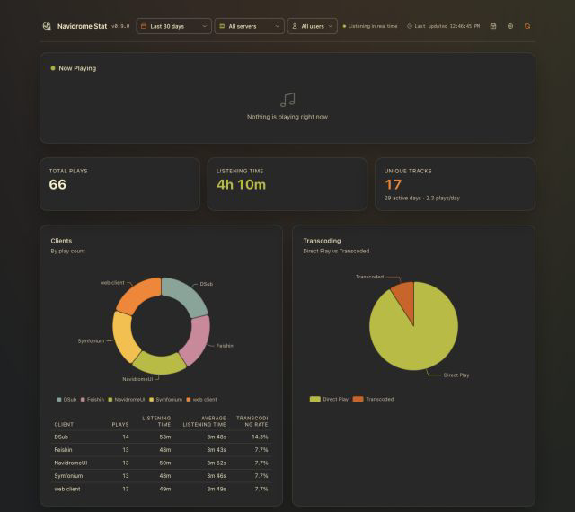

<div align="center">

<picture>
  <source media="(prefers-color-scheme: dark)" srcset="assets/icon-dark.svg">
  
</picture>

# Navidrome Stat

<a href="https://www.producthunt.com/products/navidrome-stat/launches/navidrome-stat?embed=true&amp;utm_source=badge-featured&amp;utm_medium=badge&amp;utm_campaign=badge-navidrome-stat" target="_blank" rel="noopener noreferrer"><picture><source media="(prefers-color-scheme: dark)" srcset="https://api.producthunt.com/widgets/embed-image/v1/featured.svg?post_id=1207528&amp;theme=dark&amp;t=1787616376509"></picture></a>

[](LICENSE)
[](https://hub.docker.com/r/stepaniah/navidrome-statistic)
[](https://hub.docker.com/r/stepaniah/navidrome-statistic)



</div>

[English](README.md)

Navidrome Stat 汇总 Navidrome 上报的播放活动，并通过一个仪表盘统一展示。无论使用 Subsonic 兼容客户端、浏览器、手机、电脑，还是连接多个 Navidrome 服务器，都可以得到一致的统计视图，无需每个客户端单独实现统计功能。

服务通过轮询 `getNowPlaying`、在内存中追踪收听会话、将结果保存到 SQLite，并提供完整的本地网页界面。

## 功能

- 汇总不同客户端、设备、用户和 Navidrome 服务器的当前与历史播放活动。
- 展示收听时长、播放历史、小时与每日趋势、星期 × 小时热力图、客户端使用、转码，以及艺人、专辑与曲目排行。
- 按播放次数或已记录的收听时长，对比热门艺人、专辑或客户端的时间趋势、四个时段分布，以及当前与等长上周期的数据。
- 艺人和专辑排行可打开可分享的详情视图，展示当前范围内的总量、平均单次收听、曲目数、趋势、首次与最近播放时间、热门曲目、最近播放和上周期排名变化。
- 客户端表格与关系图可打开同一统计范围内的客户端详情，但不会把客户端名称写入可分享 URL。
- 年度回顾页面：全年总量、连续收听天数、逐月与时段分布、热门榜单，以及保存在 URL 中的年份、服务器、用户和时区范围。
- 播放历史、排行与正在播放显示封面图（经认证的本地缓存代理）。
- 外观支持跟随系统、深色和浅色三种模式，以及 9 个配色家族、18 个具体变体；每个家族均有对应的深浅色方案。高级设置可在当前浏览器中实时预览并微调每个预设的六项核心颜色，按文字用途汇总对比度检查、复制 HEX 色值、保护未保存的预览，并以严格的单预设 JSON 格式导入或导出。外观选择会同步应用于统计页、年度回顾、设置和 API 文档；另提供七种界面语言。
- 仪表盘筛选条件、艺人和专辑详情与年度回顾范围均保存在 URL 中，刷新不丢失、链接可分享。
- 最近播放表格在桌面端和移动端均支持自定义显示列，按浏览器保存偏好，并可按需查看未计入播放次数的短会话详情。
- 支持自定义播放阈值与暂停宽限期、持久化会话检查点，并在上游支持时使用 OpenSubsonic 播放进度。
- 支持按服务器筛选、带首次使用引导和脱敏故障诊断的连接管理、保留策略，以及按用户导出、导入和删除 JSON 数据。
- 仪表盘与年度回顾均支持按用户和服务器筛选；年度回顾图表可在播放次数与收听时长之间切换。
- 可为仪表盘数据和接口启用 token 认证。
- 固定并自托管前端资源；发布的容器以非 root 用户运行。

## 截图

| | |
| --- | --- |
|  |  |
|  | |

## 重要限制

- 同一组数据源只能运行一个 Navidrome Stat 实例。多个实例轮询同一数据源可能导致重复计数。
- 活跃会话只保存在单个进程中，不支持多 worker 的 Uvicorn 部署。
- SQLite 中的收听记录为未加密存储；已保存的服务器凭据使用随库生成的本地密钥文件（`secret.key`）静态加密，该方案不抵御主机被完全攻陷的情形。
- 应用本身不提供 TLS。远程访问时应使用可信网络或 HTTPS 反向代理。

## Docker 部署

### 前置条件

- Docker Engine 与 Docker Compose v2
- 容器能够访问每个 Navidrome 服务器
- 拥有可调用 Subsonic API 的 Navidrome 账户

### 1. 创建部署目录

```bash
mkdir navidrome-stat
cd navidrome-stat
```

### 2. 创建 `.env`

请为 `STATS_API_TOKEN` 使用足够长的随机值。不要提交此文件，也不要把它包含在排障日志中。

```dotenv
NAVIDROME_URL=https://navidrome.example.invalid
NAVIDROME_USER=example_user
NAVIDROME_PASS=<navidrome-password>
STATS_API_TOKEN=<long-random-token>

POLL_INTERVAL=10
PLAY_THRESHOLD_SEC=30
PAUSE_GRACE_SEC=30
```

没有已保存的服务器条目时，三个 `NAVIDROME_*` 变量提供一个回退连接。对于该连接，每个非空环境变量都会优先于 SQLite 中已保存的对应值。一旦“设置 > 连接”中存在任何条目，应用只采集列表中已启用的连接；即使全部条目都被禁用，也不会重新启用回退连接。

如需汇总多个服务器，请在启动后通过“设置 > 连接”逐个添加；保存的凭据会以 AES-256-GCM 静态加密，密钥存放在数据库旁的 `secret.key`（随安装生成）。请把该文件与数据库一并备份，否则仅恢复数据库副本后需要重新输入密码；该加密可避免数据库文件与备份被直接查看，但不能防御主机完全失控。如果不能接受这种存储方式，请只使用环境变量配置的单一连接，不要通过设置页保存连接。

### 3. 创建 `compose.yaml`

如需可复现的部署，请使用具体版本标签，不要使用 `latest`。

```yaml
services:
  navidrome-stat:
    image: stepaniah/navidrome-statistic:latest
    container_name: navidrome-stat
    user: "1000:1000"
    ports:
      - "39421:39421"
    volumes:
      - navidrome-stat-data:/data
    environment:
      NAVIDROME_URL: ${NAVIDROME_URL}
      NAVIDROME_USER: ${NAVIDROME_USER}
      NAVIDROME_PASS: ${NAVIDROME_PASS}
      STATS_API_TOKEN: ${STATS_API_TOKEN}
      DATABASE_URL: /data/navidrome_stats.db
      POLL_INTERVAL: ${POLL_INTERVAL:-10}
      PLAY_THRESHOLD_SEC: ${PLAY_THRESHOLD_SEC:-30}
      PAUSE_GRACE_SEC: ${PAUSE_GRACE_SEC:-30}
      CHECKPOINT_INTERVAL_SEC: ${CHECKPOINT_INTERVAL_SEC:-60}
      SAVE_RETRY_ATTEMPTS: ${SAVE_RETRY_ATTEMPTS:-3}
      MAX_POLL_BACKOFF_SEC: ${MAX_POLL_BACKOFF_SEC:-60}
      RETENTION_MAINTENANCE_SEC: ${RETENTION_MAINTENANCE_SEC:-86400}
      SESSION_COOKIE_SECURE: ${SESSION_COOKIE_SECURE:-false}
      STATS_METRICS_AUTH: ${STATS_METRICS_AUTH:-false}
      OPENAPI_ENABLED: ${OPENAPI_ENABLED:-true}
    restart: unless-stopped
    healthcheck:
      test:
        - CMD
        - python
        - -c
        - "import urllib.request; urllib.request.urlopen('http://127.0.0.1:39421/health')"
      interval: 30s
      timeout: 5s
      retries: 3
      start_period: 20s

volumes:
  navidrome-stat-data:
```

### 4. 启动服务

```bash
docker compose up -d
docker compose ps
```

打开 `http://localhost:39421`。配置 `STATS_API_TOKEN` 后，在登录界面输入该 token；浏览器保存的是 HttpOnly 会话 Cookie，而不是 token 本身。

`/health` 用于检查进程是否存活。`/health/ready` 还会检查数据库、采集器、上游轮询与播放记录持久化。上游或数据库故障可能使就绪状态降级或未就绪，但进程仍保持存活。

## 配置

| 变量 | 默认值 | 说明 |
| --- | --- | --- |
| `NAVIDROME_URL` | 无 | 回退连接使用的 Navidrome 基础 URL；仅在已保存的服务器列表为空时使用。 |
| `NAVIDROME_USER` | 无 | 回退 Subsonic 连接使用的用户名。 |
| `NAVIDROME_PASS` | 无 | 回退 Subsonic 连接使用的密码。 |
| `DATABASE_URL` | `.data/navidrome_stats.db` | 新本地检出默认使用的 SQLite 文件路径；若根目录已有 `navidrome_stats.db`，仍会继续使用。Docker Compose 设置为 `/data/navidrome_stats.db`。虽然名称中包含 URL，但不支持其他数据库。 |
| `STATS_API_TOKEN` | 空 | 设置后保护仪表盘数据、应用接口和 OpenAPI 路由。 |
| `STATS_METRICS_AUTH` | `false` | 本项与 `STATS_API_TOKEN` 同时设置时，`/metrics` 需要认证。 |
| `STATS_QUERY_BUDGET_MS` | `250` | `/metrics` 使用的每个仪表盘子查询预算，限制在 10–60000 毫秒；用于监控查询性能回归，不会自动启用汇总表。 |
| `COVER_ART_RESPONSE_MAX_BYTES` | `10485760` | 封面代理接受的上游单响应大小上限，限制在 65536–67108864 字节。 |
| `OPENAPI_ENABLED` | `true` | 设为 `false` 时移除 `/docs`、`/redoc` 和 `/openapi.json`。 |
| `POLL_INTERVAL` | `10` | 轮询间隔，限制在 5–300 秒。 |
| `PLAY_THRESHOLD_SEC` | `30` | 计为一次播放所需的有效播放秒数，限制在 1–3600。 |
| `PAUSE_GRACE_SEC` | `30` | 在内存中保留暂停或暂时消失会话的秒数，限制在 0–3600。 |
| `CHECKPOINT_INTERVAL_SEC` | `60` | 活跃会话持久化检查点的刷新间隔，限制在 10–3600 秒。 |
| `SAVE_RETRY_ATTEMPTS` | `3` | 会话数据库写入尝试次数，限制在 1–10。 |
| `MAX_POLL_BACKOFF_SEC` | `60` | 上游故障退避上限，限制在 1–3600 秒。 |
| `BACKFILL_INTERVAL_SEC` | `3600` | 已配置的智能播放列表回填复查间隔，限制在 300–86400 秒。 |
| `BACKFILL_CUTOFF_MARGIN_SEC` | `60` | 导入前从实时轮询覆盖边界回退的安全边距，限制在 0–3600 秒。 |
| `RETENTION_MAINTENANCE_SEC` | `86400` | 自动执行保留期清理的间隔，限制在 60–604800 秒。 |
| `SESSION_COOKIE_SECURE` | `false` | 为登录 Cookie 添加 Secure 标记；用户通过 HTTPS 访问时应启用。 |

环境变量在应用启动时解析。修改后需重启容器。

## 播放计数方式

当累计有效播放时长达到 `PLAY_THRESHOLD_SEC` 时，一首曲目计为一次播放。暂停或暂时消失的时间不计入时长。达到阈值时会创建检查点，之后的检查点与会话结算只更新同一条数据库记录，不会重复增加播放次数。

服务器声明支持 OpenSubsonic `playbackReport` 扩展时，媒体位置和播放状态可提高时长统计质量；其他服务器继续使用常规轮询。未达到播放阈值便结束的会话会单独记录为播放尝试。

“最近播放”中的信息按钮会显示这类短会话占已追踪播放尝试的比例。安装前回填和原生历史导入不属于应用采集的实时会话，因此不进入该比例；从 Navidrome Stat 隐私归档恢复的记录则保留原有的计数属性。

## 恢复安装前的收听历史

可选：在已保存的服务器连接上填写一个 Navidrome 智能播放列表（`.nsp`，如「最近播放」）。服务会通过公开的 `getPlaylist` API 定期读取它，并按每首曲目的最后播放时间导入一条估算播放记录。重复运行绝不产生重复行，实时轮询已覆盖的收听会被跳过，且只导入安装前真实发生过的播放——playCount 暗示的更早次数不会被虚构。到设置页对相应连接填写播放列表 ID 即可启用。

详细原理见[架构说明](docs/architecture.md)。

## 日常运维

### 日志

```bash
docker compose logs -f --tail=100 navidrome-stat
```

发布容器会关闭请求访问日志，避免将应用 URL 中的仪表盘筛选条件、用户名、数据源标识和可分享的艺人或专辑详情名称写入容器日志；应用日志也不会输出播放元数据和上游请求 URL。自定义应用服务器、反向代理与 Navidrome 可能仍有各自的访问日志，分享日志前请检查相关配置。

### 故障排查

| 现象 | 检查项 |
| --- | --- |
| `/health` 正常，但 `/health/ready` 显示降级或未就绪 | 查看 `/health/ready` 中的数据库、采集器、上游与持久化检查；确认至少有一个配置完整且已启用的连接、数据目录可写，并检查容器到 Navidrome 的网络连接。 |
| 已保存的连接没有采集播放活动 | 打开“设置 > 连接”，按诊断结果排查认证、TLS、超时、网络或采集器问题。确认连接已启用；如问题仍存在，再检查 `docker compose logs`。 |
| 反复出现登录页或 API 返回 `401` | 输入当前的 `STATS_API_TOKEN`。通过 HTTPS 访问时设置 `SESSION_COOKIE_SECURE=true`；使用普通 HTTP 时保持为 `false`。 |
| SQLite 无法打开或写入 | 确认 `DATABASE_URL` 指向已挂载的数据卷，并确认 UID 和 GID `1000:1000` 对目录和数据库文件具有写权限。 |

### 更新

```bash
docker compose pull
docker compose up -d
```

更新固定版本前，请备份数据卷并阅读变更记录。

### 备份与恢复

数据卷包含收听历史与凭据密钥文件，也可能包含已保存的 Navidrome 凭据。所有备份都应按敏感数据处理。

先停止服务并归档完整数据卷，使数据库与对应的 `secret.key` 始终保存在同一份备份中：

```bash
mkdir -p backups
docker compose stop navidrome-stat
docker run --rm \
  --volumes-from navidrome-stat:ro \
  -v "$PWD/backups:/backup" \
  alpine:3.20 \
  tar -C /data -czf /backup/navidrome-stat-data.tar.gz .
docker compose start navidrome-stat
```

依赖备份前，应先在生产卷之外解压，并对恢复副本执行 SQLite 完整性检查：

```bash
mkdir -p restore-test
docker run --rm \
  -v "$PWD/backups:/backup:ro" \
  -v "$PWD/restore-test:/restore" \
  alpine:3.20 \
  tar -C /restore -xzf /backup/navidrome-stat-data.tar.gz
test -f restore-test/navidrome_stats.db
test -f restore-test/secret.key || echo "此备份中没有凭据密钥"
docker compose run --rm --no-deps \
  -e DATABASE_URL=/restore/navidrome_stats.db \
  -v "$PWD/restore-test:/restore:ro" \
  navidrome-stat \
  python -c "import sqlite3; db = sqlite3.connect('file:/restore/navidrome_stats.db?mode=ro', uri=True); result = db.execute('PRAGMA integrity_check').fetchone()[0]; assert result == 'ok', result; print(result)"
```

恢复生产环境时，应停止服务、保留当前数据卷、把已验证的归档解压到空的替代卷，并确认 UID 和 GID `1000:1000` 可写恢复后的文件。使用原先固定的应用版本启动，验证 `/health/ready` 并测试已保存的连接。若归档中没有 `secret.key`，需要在设置页重新输入密码。不要把归档合并到正在使用或已有内容的数据卷中。

## 安全与隐私

- 未设置 `STATS_API_TOKEN` 时，仪表盘数据和接口允许匿名访问，只应在可信网络中使用。
- `STATS_API_TOKEN` 只有一个共享权限级别：持有者既能查看数据，也能修改连接和设置，并执行导入、保留期清理或删除操作；它不是只读用户账号。
- `/health` 与 `/health/ready` 始终公开。`/metrics` 默认公开；设置 token 并启用 `STATS_METRICS_AUTH=true` 后可要求认证。
- `/metrics` 除轮询与持久化健康外，还包含仪表盘构建/缓存、固定子查询耗时与预算超限、SQLite busy 重试、导入耗时和封面缓存指标。
- 启用认证后，仪表盘静态文件仍可加载，但数据请求需要授权。
- 浏览器策略只允许加载本服务的脚本与样式，禁止可执行的内联脚本、嵌入对象和跨域表单目标，同时允许页面所需的内联样式。
- 播放记录默认永久保留；保存 1–360 天的有限策略，即授权服务在启动和后台维护时自动清理超期记录。
- 收集播放活动前应告知受影响的用户，并选择适当的保留期。

详细说明见[隐私文档](docs/privacy.md)与[安全政策](SECURITY.md)。

## 开发

项目支持 Python 3.11。

新的本地检出会把数据库、凭据密钥和封面缓存集中存放在 Git 忽略的 `.data/` 下。如果根目录已有旧的 `navidrome_stats.db`，应用会继续使用它，直到你明确把数据库与对应的 `secret.key` 一并移动，或设置 `DATABASE_URL`。

```bash
python3.11 -m venv .venv
source .venv/bin/activate
pip install -r requirements-dev.txt
ruff check .
pytest -q --cov=src --cov-report=term-missing --cov-fail-under=80
uvicorn src.main:app --host 127.0.0.1 --port 39421 --no-access-log
```

仓库还提供用于构建当前本地检出的 [`docker-compose.yml`](docker-compose.yml)：

```bash
git clone https://github.com/StepaniaH/navidrome-stat.git
cd navidrome-stat
docker compose up -d --build
```

前端资源和浏览器测试使用 Node.js：

```bash
npm ci
npx playwright install chromium
npm run test:e2e
```

测试使用临时数据库和合成 API 数据，不需要连接真实 Navidrome 服务器。

## 项目信息

- [架构说明](docs/architecture.md)
- [路线图](docs/roadmap.md)
- [隐私说明](docs/privacy.md)
- [贡献指南](CONTRIBUTING.md)
- [变更记录](CHANGELOG.md)
- [安全政策](SECURITY.md)

## 许可证

Navidrome Stat 使用 [MIT License](LICENSE)。随应用分发的 Tailwind CSS 与 Apache ECharts 在 `src/static/vendor/` 中保留各自的许可证和声明文件。
